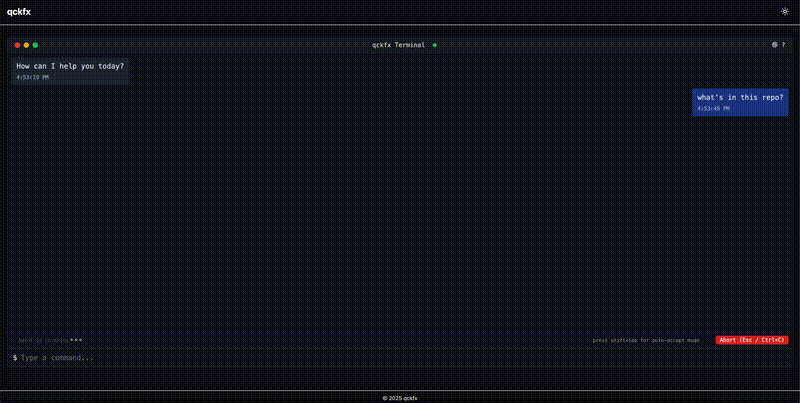

<div id="toc" align="center">
  <ul style="list-style: none">
    <a href="https://github.com/qckfx/agent">
      <h1>qckfx agent</h1>
      <p>A powerful software engineering AI assistant for your terminal</p>
    </a>
  </ul>
</div>

<p align="center">
  Chat with an AI that can read files, search your codebase, and execute bash commands.<br>
  Compatible with workflows similar to Anthropic's Claude Code.
</p>

<p align="center">
  <a href="https://github.com/qckfx/agent/blob/main/LICENSE">
    
  </a>
  <a href="https://discord.gg/DbTkJm43s5">
    
  </a>
  <a href="https://www.npmjs.com/package/qckfx">
    
  </a>
  <a href="https://qckfx.com">
    
  </a>
</p>

<p align="center">
  <a href="https://discord.gg/DbTkJm43s5">
    
  </a>
</p>

<p align="center">
  
</p>

---

## Quick Start

```bash
ANTHROPIC_API_KEY=your_key_here npx qckfx
```

## Core Features

1. **File Operations**: Read, edit, and create files in your codebase
2. **Code Search**: Find code with glob patterns and grep-like searches
3. **Bash Command Execution**: Run terminal commands with proper permission handling
4. **Interactive Chat**: Have multi-turn conversations with context preservation
5. **Claude Integration**: Powered by Anthropic's Claude models with tool calling
6. **Web UI**: Browser-based interface for interacting with the agent
7. **Real-time Tool Visualization**: See tools executing in real-time with status indicators

## Architecture

qckfx agent combines an intelligent LLM with a modular set of tools that interact with your development environment:

```
qckfx agent
├── Core
│   ├── AgentRunner (orchestrates the entire process)
│   ├── ToolRegistry (manages available tools)
│   ├── PermissionManager (handles permission requests)
│   └── ModelClient (interacts with the LLM)
├── Providers
│   ├── AnthropicProvider (for Claude models)
│   └── (other providers)
├── Server
│   ├── Express Server (for Web UI)
│   ├── API Endpoints
│   ├── WebSocket Support (real-time updates)
│   └── Static File Serving
├── Tools
│   ├── BashTool
│   ├── GlobTool
│   ├── GrepTool
│   ├── LSTool
│   ├── FileReadTool
│   ├── FileEditTool
│   └── FileWriteTool
└── Utils
    ├── Logger
    ├── Error Handling
    └── Token Management 
```

## Installation

```bash
# Install globally
npm install -g qckfx

# Or run directly with npx
npx qckfx
```

## Usage Examples

### Basic Terminal Usage

Just run the command and start chatting:

```bash
# With global installation
ANTHROPIC_API_KEY=your_key_here qckfx

# Or with npx
ANTHROPIC_API_KEY=your_key_here npx qckfx
```

This will start an interactive session where you can chat with Claude. The agent can use a variety of tools to assist you with software development tasks.

### CLI Options

The qckfx CLI supports several options to customize your experience:

```bash
# Basic usage
qckfx [options]

Options:
  -h, --help               Display help information
  -v, --version            Display version information
  -d, --debug              Enable debug logging
  -q, --quiet              Minimal output, show only errors and results
  -m, --model <model>      Specify the Claude model to use (default: claude-3-7-sonnet-20250219)
  -e, --e2bSandboxId <id>  Run agent tools in an E2B sandbox (requires sandbox ID)
  --web                    Enable web UI (default: true)
  --no-web                 Disable web UI
  --port <port>            Port for web UI (default: 3000)
```

### E2B Integration

The E2B integration allows you to run agent tools in an isolated sandbox environment. This provides enhanced security and reproducibility as all file operations and command executions happen in the cloud-based sandbox instead of your local machine.

To use this feature:

1. Install the E2B SDK:
   ```bash
   npm install -g e2b
   ```

2. Create an E2B sandbox:
   ```bash
   e2b sbx sp
   ```
   This will create a sandbox and provide you with a sandbox ID.

3. Run qckfx with the E2B option:
   ```bash
   ANTHROPIC_API_KEY=your_key_here qckfx -e <sandbox-id>
   ```

When running with the E2B integration, all tool operations (file reading/writing, command execution, etc.) will be performed in the isolated E2B sandbox rather than on your local machine.

Example conversation:
```
> tell me what this repo does

✔ Response ready
[INFO] [tools] 
🔧 Tools Used:
[INFO] [tools]   1. ls(details: true)
[INFO] [tools]   2. file_read(README.md)
[INFO] [tools]   3. file_read(package.json)
[INFO] [tools]   4. ls(src, details: true)
[INFO] [tools]   5. file_read(src/index.ts)
[INFO] [tools] 
[INFO] [user] 🤖 Based on my exploration of the repository, here's what this repo does:

# qckfx agent

This is a CLI-based AI software engineering assistant that runs in your terminal. It's designed to help developers with coding tasks by providing an AI assistant that can interact with your codebase.

## Key Features:

1. **File Operations**: The agent can read, edit, and create files in your codebase.
2. **Code Search**: It can find code using glob patterns and grep-like searches.
3. **Bash Command Execution**: It can run terminal commands with proper permission handling.
4. **Interactive Chat**: It supports multi-turn conversations with context preservation.
5. **Claude Integration**: It's powered by Anthropic's Claude models with tool calling capabilities.

## Architecture:

The project follows a modular, composition-based approach with these main components:

- **Core**: Includes AgentRunner (orchestrates the process), ToolRegistry (manages tools), PermissionManager (handles permissions), and ModelClient (interacts with the LLM).
- **Providers**: Currently includes AnthropicProvider for Claude models.
- **Tools**: Various tools like BashTool, GlobTool, GrepTool, LSTool, FileReadTool, FileEditTool, FileWriteTool, and ScratchpadTool.
- **Utils**: Includes Logger, Error Handling, and Token Management.

## Usage:
```bash
ANTHROPIC_API_KEY=your_key_here npx qckfx
```

This starts an interactive session where you can chat with Claude. The agent can assist with various software development tasks like debugging, code generation, refactoring, codebase exploration, and testing.

The project is MIT licensed and is part of the qckfx platform, which also offers a hosted solution at qckfx.com for fixing GitHub issues asynchronously and autonomously.
```

### Advanced Use Cases

The agent excels at complex software development tasks:

- **Debugging**: "Why is this function returning undefined when I pass an empty array?"
- **Code Generation**: "Write a utility function that validates email addresses"
- **Refactoring**: "Help me convert this class component to a functional component"
- **Exploration**: "Explain how the routing works in this codebase"
- **Testing**: "Generate unit tests for this API endpoint"

## Web Interface

qckfx includes a web interface for interacting with agents through a browser. To use it:

```
npm run start:dist
```

Then open your browser to http://localhost:3000

### Configuration

The web UI can be configured using the following command-line options:

- `--web` - Enable the web UI (default: true)
- `--no-web` - Disable the web UI
- `--port <port>` - Specify the port for the web UI (default: 3000)

Alternatively, you can use environment variables:

- `QCKFX_DISABLE_WEB=true` - Disable the web UI
- `QCKFX_PORT=<port>` - Specify the port for the web UI
- `QCKFX_HOST=<host>` - Specify the host to bind to (default: localhost)

### Terminal UI Documentation

The terminal UI provides a rich, interactive experience with various features:

- [Terminal UI Overview](docs/ui/terminal-ui.md)
- [Keyboard Shortcuts](docs/ui/keyboard-shortcuts.md)
- [Message Types](docs/ui/message-types.md)
- [Theme Customization](docs/ui/theme-customization.md)
- [Accessibility Features](docs/ui/accessibility.md)
- [Tool Visualization](docs/ui/tool-visualization.md)

## What's New in v0.1.5

### Web Interface and Server
- Complete browser-based terminal interface for interacting with the agent
- Modern, responsive UI with support for keyboard shortcuts
- Light and dark themes with customization options
- Full WebSocket integration for real-time updates
- RESTful API endpoints for programmatic integration
- Session management for individual conversation threads

### Tool Visualization
- Real-time visualization of tool executions in the terminal UI
- Visual status indicators for running, completed, and error states
- Parameter summaries and execution timing information
- Expandable parameter details for deeper inspection
- Accessible design with proper ARIA attributes

### WebSocket Improvements
- Enhanced real-time message streaming
- Optimized connection management for better reliability
- Message buffering for improved performance

### API Endpoints
- `/api/sessions` - Create and manage agent sessions
- `/api/agent/query` - Send messages to the agent
- `/api/permissions` - Manage tool permissions
- WebSocket events for real-time updates
- Comprehensive error handling and validation

### Development

For full-stack development with both backend and frontend:

```bash
npm run dev
```

This will:
1. Start the TypeScript watcher for backend code
2. Launch the backend server on port 3000
3. Wait for the backend to be ready
4. Start the frontend UI server on port 5173

You can then access the web UI at http://localhost:5173

For frontend-only development, you can run just the Vite dev server:

```bash
npm run dev:ui
```

For backend-only development:

```bash
npm run dev:server
```

See [frontend development guide](docs/web-server/frontend-development.md) for more information.

## Hosted Solution

Visit [qckfx.com](https://qckfx.com) for a hosted version of qckfx, designed specifically for fixing GitHub issues asynchronously and fully-autonomously.

## License

MIT